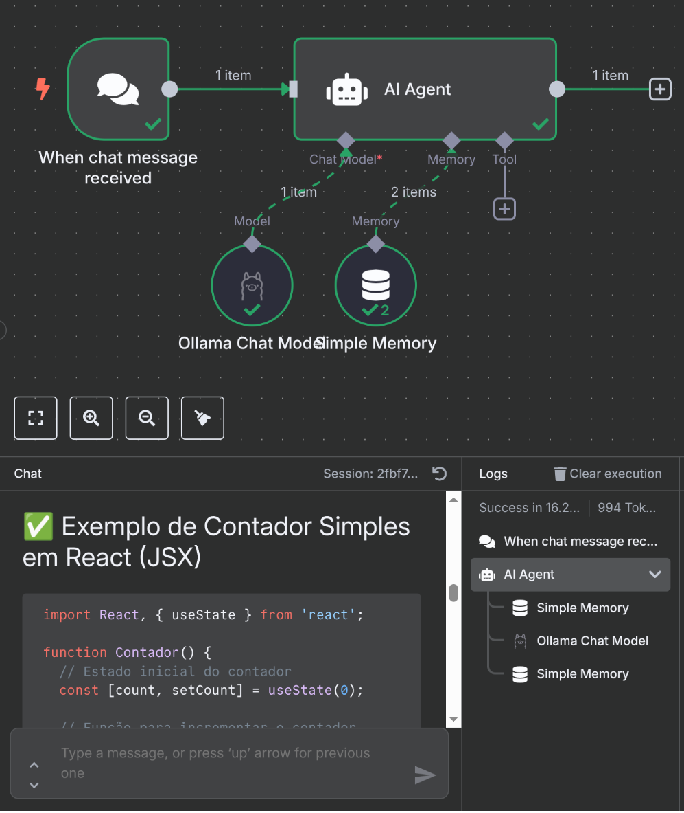

Para rodar o n8n no seu computador, você pode utilizar o Docker, que é a forma mais recomendada e fácil de instalar.  
Para isso, é necessário ter o Docker instalado. Se ainda não tiver, siga o guia de instalação do Docker para o seu sistema operacional.

Para instalar o n8n via Docker, execute o seguinte comando (recomendado para Linux):

```bash
sudo docker run -it --rm \
  --name n8n \
  --network host \
  -v n8n_data:/home/node/.n8n \
  docker.n8n.io/n8nio/n8n \
  start
````

Se preferir, você também pode instalar usando o `npm`:

```bash
npm install -g n8n
```

---

## Acessando a interface web

Após iniciar o n8n, acesse a interface web pelo seu navegador, utilizando:

```bash
http://localhost:5678
```

Você verá a tela de boas-vindas, onde poderá criar seu primeiro fluxo de trabalho.

---

## Criando seu primeiro fluxo de trabalho

Para criar seu primeiro workflow, clique no botão **"New Workflow"** na tela inicial.
Você será direcionado para a interface de edição, onde poderá arrastar e soltar nós para montar seu fluxo.

### Passo a passo:

1. Adicione um **Chat Trigger**, que será o gatilho do seu fluxo.
   Clique em **"Add Node"** e selecione **"Chat Trigger"**.

2. Em seguida, adicione um **AI Agent**.
   Clique novamente em **"Add Node"** e selecione **"AI Agent"**.

Para manter a simplicidade, vamos utilizar o modelo **Qwen3**, já explicado no artigo anterior.
Clique no nó **Chat Model**, selecione **Ollama Chat Model**, e configure a credencial com a URL:
`http://127.0.0.1:11434`

### (Opcional) Adicionar Memória:

Você pode adicionar um nó de memória para armazenar o histórico da conversa.
Clique em **"Add Node"**, selecione **"Memory"** e depois **"Simple Memory"**.
Isso permitirá que o modelo de IA responda com mais contexto, utilizando o histórico do chat.

---

## Testando o fluxo

Com isso, você terá um fluxo básico configurado no n8n, utilizando o modelo **Qwen3** como IA.
Clique em **"Execute Workflow"** e interaja com o chat para testá-lo.



---

## Conclusão

O n8n é uma ferramenta poderosa para automação de fluxos de trabalho e integração com diversos serviços.
Com ele, é possível criar automações complexas de forma visual e intuitiva, sem precisar escrever código.

Neste artigo, você aprendeu como instalar o n8n e configurar um fluxo básico utilizando o Qwen3.
Explore mais recursos da ferramenta e vá além, integrando outros serviços e criando soluções mais elaboradas.

Para saber mais, acesse a [documentação oficial do n8n](https://n8n.io/).

Em breve, trarei mais exemplos de Workflows, como:

* Geração de embeddings e indexação de documentos;
* Criação de um chatbot completo com n8n e Ollama.


